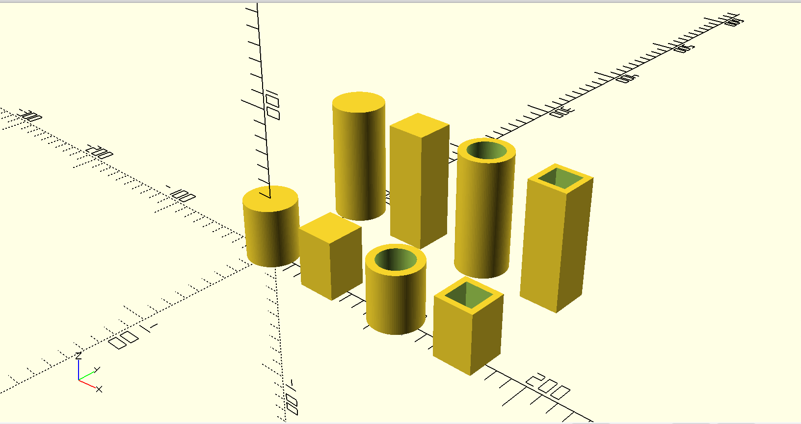

# Quarto | Board Games in The Metaverse??

## [What is Quarto?](https://boardgamegeek.com/boardgame/681/quarto)
> Quarto has a 4×4 board and 16 pieces. Each piece has four dichotomous attributes — color, height, shape, and consistency — so each piece is either black or white, tall or short, square or round, and hollow or solid. The objective is to place the fourth piece in a row in which all four pieces have at least one attribute in common. The twist is that your opponent gets to choose the piece you place on the board each turn.

### Software
The game pieces were designed using openscad. The interactive game is still under development. I will most likey use react and webGL or possibly threeJs to handle the 3d rendering.

### Hardware

I designed the game pieces using open scad. Relativity easy but feel free to build upon it. You need to print each
item in the big/small folder in two different colors. Strength is not super important so you can use lighter infill.
I used 10% infill for my prints.

### Machine Learning
... Coming Soon ;)

### Robotics
Im planning to use RFID/NFC to identify each game piece. Then once the AI bot is done i will load the movement scripts into my robotic arm to play against me
